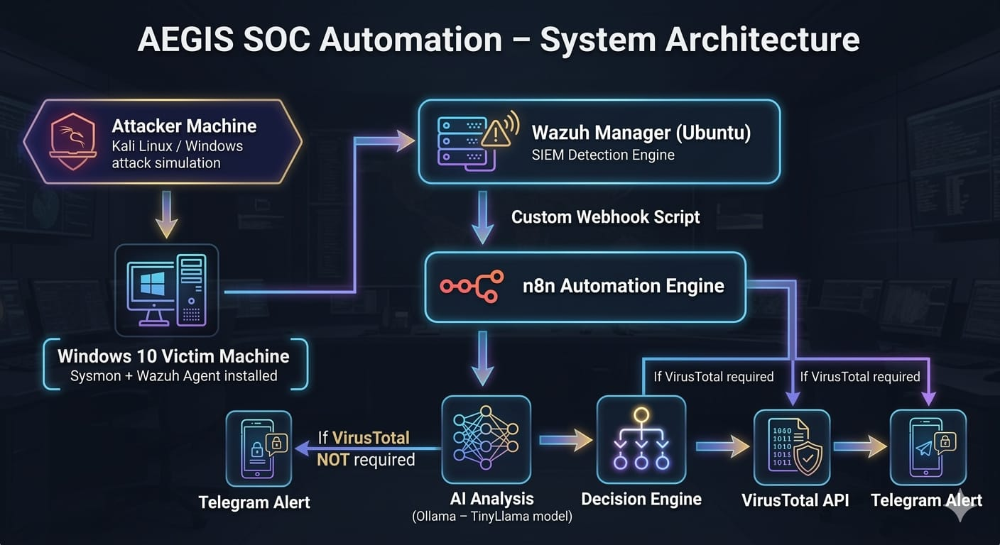

# AEGIS – AI Driven SOC Automation

AEGIS is a Security Operations Center (SOC) automation project that integrates
Wazuh SIEM with automation workflows to detect, analyze, and respond to security alerts.

The platform simulates a real SOC pipeline by combining security monitoring,
automation workflows, AI-assisted alert analysis, threat intelligence enrichment,
and real-time incident notifications.

---

## Architecture

### Architecture Flow

1. Attacker machine simulates malicious activity using Kali Linux or Windows attack tools.
2. The Windows 10 victim machine runs Sysmon and the Wazuh agent to collect detailed security logs.
3. Wazuh Manager (Ubuntu) acts as the SIEM detection engine and generates security alerts.
4. A custom webhook script forwards alerts from Wazuh to the automation pipeline.
5. n8n automation engine processes the alert and sends it for AI analysis.
6. AI analysis using Ollama TinyLlama evaluates the alert and determines threat context.
7. A decision engine determines whether threat intelligence enrichment is required.
8. If required, the system queries the VirusTotal API for reputation analysis.
9. The final SOC alert is sent automatically through a Telegram bot.

---

## Technologies Used

- Wazuh SIEM
- Sysmon
- n8n Automation
- VirusTotal API
- Telegram Bot

---

## Workflow

1. Wazuh detects suspicious activity on monitored systems.
2. Alerts are forwarded through a webhook to an n8n automation workflow.
3. AI analyzes the alert and determines severity and threat context.
4. VirusTotal enrichment checks threat intelligence for malicious indicators.
5. A structured SOC alert is automatically delivered through a Telegram bot.

---

## Screenshots

### Wazuh Detection

---

### Automation Workflow

---

### SOC Alert Notification

---

## Project Objective

The goal of this project is to demonstrate how Security Operations Centers can
automate alert analysis and threat intelligence enrichment to reduce manual
investigation effort and improve incident response time.

---

## Future Improvements

- Add automated threat blocking
- Integrate additional threat intelligence sources
- Expand detection rules and monitoring coverage
